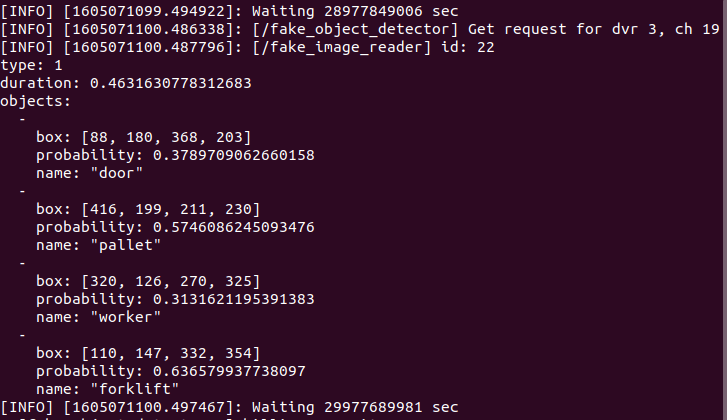

# cctv_monitoring

Tag:
- rospy
- rosservice

Before using, give permission to script files
```
$ sudo chmod +x src/ms_perception/scripts/fake_image_reader.py
$ sudo chmod +x src/ms_perception/scripts/fake_object_detector.py
```

Run
```
$ roslaunch ms_perception demo_findobjects_service.launch
```

Example terminal outputs

